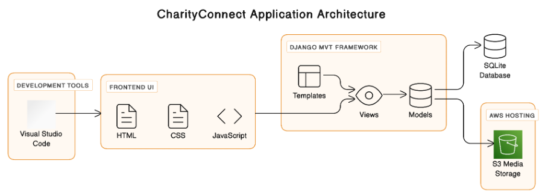
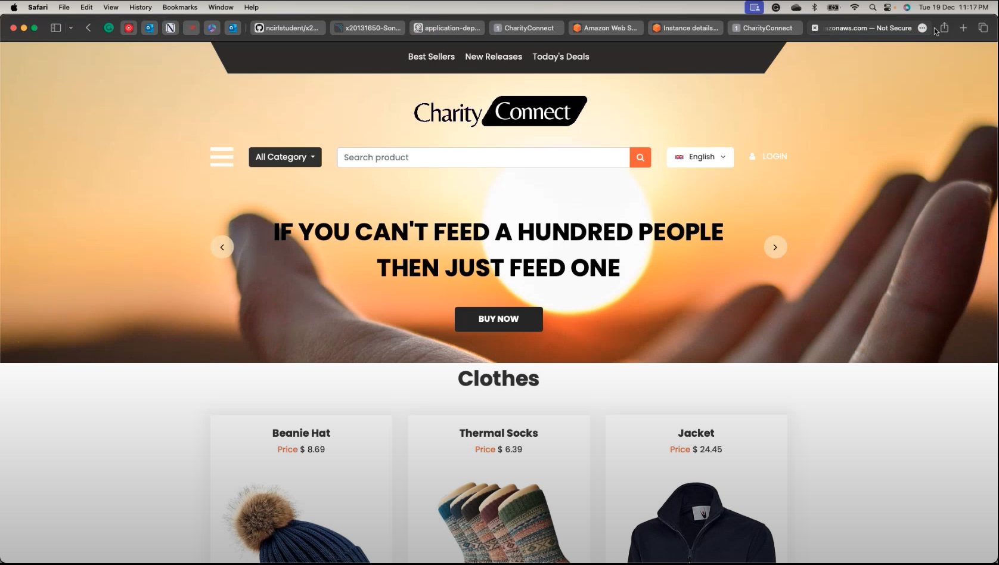
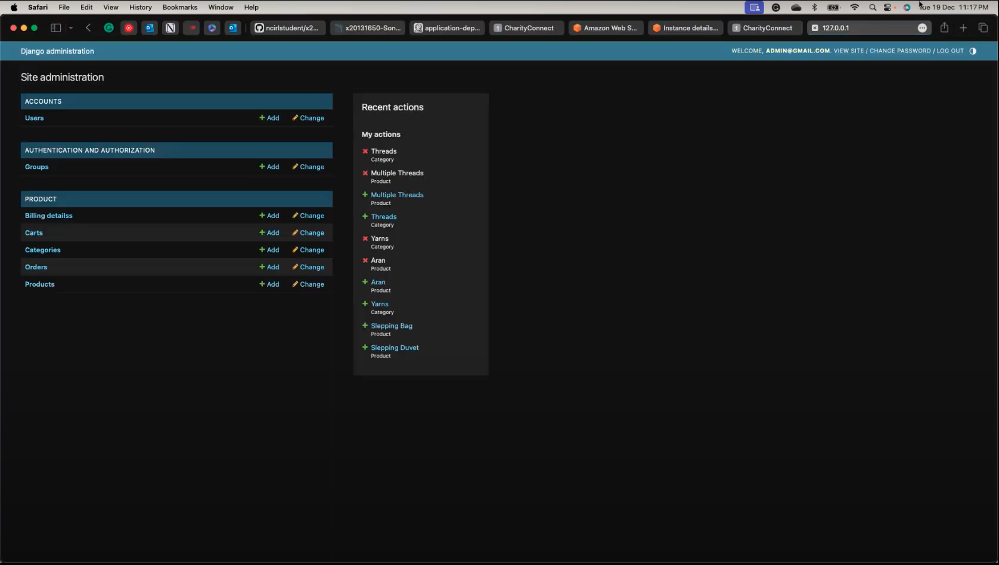

# CharityConnect - Cloud-Based Web Application

## Project Overview
CharityConnect is a cloud-based platform designed to empower non-profit organizations by improving their reach, awareness, and fundraising capabilities. This project leverages cloud infrastructure to simplify the donation and item purchasing process, especially during challenging times, such as harsh winters when the need for donations peaks.

The platform aims to enhance efficiency and scalability, providing a centralized way for non-profits to connect with donors and volunteers. This project was built using AWS services, Jenkins for CI/CD, and Terraform for infrastructure as code, ensuring a reliable, automated, and secure deployment process.

## Key Features
- **User-Friendly Interface**: Simplifies browsing and purchasing of donated items.
- **Automated CI/CD**: Jenkins pipeline to automate the integration and delivery process.
- **Infrastructure as Code**: Uses Terraform for provisioning cloud resources.
- **Security Integration**: OWASP Sonarqube integrated to ensure best practices are followed.
- **Scalable Infrastructure**: Leveraging AWS EC2 and S3 to ensure scalability and storage of media assets.

## Architecture
CharityConnect uses the Model-View-Template (MVT) architectural pattern, implemented using the Django web framework. The application is designed to be modular and scalable, utilizing multiple AWS services to support its core functionalities.

### Key Components
- **Frontend**: Built using HTML, CSS, and JavaScript for a responsive user experience.
- **Backend**: Powered by Django to handle business logic and database interactions.
- **Database**: SQLite for development; AWS EC2 for hosting and scalability.
- **Cloud Services**: AWS EC2 for virtual servers, AWS S3 for media storage, and AWS Elastic Beanstalk for deployment automation.



## Technologies Used
- **Cloud Services**: AWS (EC2, S3, Elastic Beanstalk)
- **CI/CD**: Jenkins for automated builds, testing, and deployments.
- **Infrastructure as Code**: Terraform to provision AWS infrastructure.
- **Security Tools**: OWASP Sonarqube for code analysis and vulnerability checks.
- **Web Framework**: Django (Python)
- **Version Control**: GitHub for source code management

## Setup and Deployment
The deployment of CharityConnect follows a CI/CD approach using Jenkins. The infrastructure is provisioned using Terraform, ensuring consistency and reproducibility.

### Prerequisites
- **AWS Account**: To provision the necessary cloud resources.
- **Jenkins**: Installed and configured for CI/CD.
- **Terraform**: Installed locally or on your CI/CD server to manage infrastructure as code.

### Deployment Steps
1. **Clone the Repository**:
   ```bash
   git clone https://github.com/yourusername/CharityConnect-WebApp.git
   ```

2. **Set Up Infrastructure**:
   - Navigate to the `terraform/` directory.
   - Initialize and apply Terraform scripts:
     ```bash
     terraform init
     terraform apply
     ```

3. **Configure Jenkins Pipeline**:
   - Add the `Jenkinsfile` to your Jenkins server to automate the build and deployment process.

4. **Run the Application**:
   - Access the deployed application via the provided EC2 public IP or domain.

## Installation
To set up the project locally, follow these steps:

1. **Create and Activate Virtual Environment**:
   ```bash
   python3 -m venv eshopenv
   source eshopenv/bin/activate
   ```

2. **Install Dependencies**:
   ```bash
   python3 -m pip install -r requirements.txt
   ```

3. **Add New Library**:
   ```bash
   python3 -m pip install eshop-cart==1.0.0
   ```

4. **Run Migrations**:
   ```bash
   python3 manage.py migrate
   ```

5. **Run the Server**:
   ```bash
   python3 manage.py runserver 8080
   ```

## For Admin Login
To create an admin user, run the following command:

```bash
python3 manage.py createsuperuser
```

- **Email**: Admin@gmail.com
- **Username**: Admin
- **Password**: Admin@123

You can then add products and categories from the admin panel:
- [Admin Panel](http://127.0.0.1:8080/admin)

Access the application locally at [http://127.0.0.1:8080](http://127.0.0.1:8080).

## Security Considerations
- **OWASP Sonarqube** is used to scan the codebase to identify vulnerabilities before deployment.
- **Jenkins Pipeline** includes security testing to ensure that each build adheres to industry standards.

## Screenshots
### Home Page


### Admin Dashboard


## Future Enhancements
- **Payment Integration**: Adding secure payment gateways to support monetary donations.
- **User Roles**: Enhancing the platform to include multiple user roles with different levels of access.
- **Analytics Dashboard**: For non-profits to track donations and user engagement.

## Contact
**Developer**: Arjun Jadhav  
**Email**: [Arjunjadhav1993@outlook.com](mailto:Arjunjadhav1993@outlook.com)  
**LinkedIn**: [linkedin.com/in/arjunjadhav](https://linkedin.com/in/arjunjadhav)

## Video Demonstration
Watch the full project demo [here](https://youtu.be/TUdjQDRFuQ4).